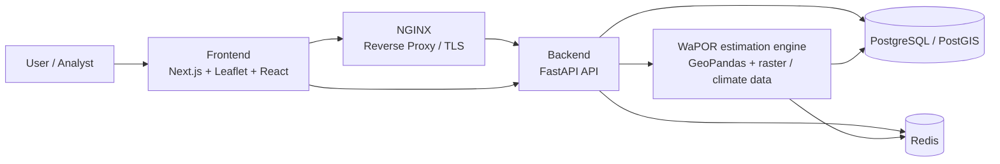
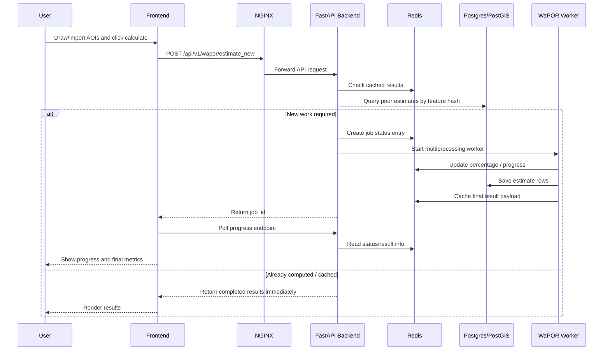

# Architecture

## Overview

Wheat Water Productivity Tool (WWPT) to estimate wheat grain yield and crop water productivity using FAO WaPOR v3 satellite data, including seasonal Net Primary Production (NPP) and actual evapotranspiration (AETI), applying the FAO biomass-to-yield methodology.

The project is a geospatial web application for estimating wheat water productivity (WaPOR-based analysis) for user-defined agricultural plot geometries. It combines a Next.js map interface, a FastAPI backend, PostGIS for persistent storage, Redis for async job tracking, and NGINX for reverse proxying and TLS termination.

The main application flow is:

1. A user draws or imports a polygon / plot on the map in the frontend.
2. The frontend sends feature data to the backend estimation API.
3. The backend validates the GeoJSON input and either:
   - performs a synchronous estimation for small requests, or
   - queues a background job for larger or repeated workloads using Redis and multiprocessing.
4. Outputs are stored in PostgreSQL/PostGIS and cached in Redis to avoid repeated computation.
5. The frontend polls job status and renders the results in the map and result panels.

## High-level system diagram

## Components

### 1. Frontend

Location: `frontend/`

Technologies:
- Next.js 16
- React 19
- TypeScript
- Leaflet + react-leaflet
- Turf.js and Geoman for map editing
- Tailwind CSS

Responsibilities:
- render the interactive map
- allow import / draw / edit / remove of AOI polygons
- collect plot metadata (including dates, location, IDs)
- trigger estimation requests
- display progress and results
- export or visualize result data

Key files:
- `frontend/app/page.tsx` — main page, state orchestration, API calls
- `frontend/components/map/` — map interactions and overlays
- `frontend/components/ui/` — forms, notifications, progress tracking, result panels

### 2. Backend API

Location: `backend/app/`

Technologies:
- FastAPI
- SQLModel + PostgreSQL
- GeoAlchemy2 + PostGIS
- Redis client
- GeoPandas / shapely / xarray / rasterio / rioxarray

Responsibilities:
- expose estimation endpoints
- validate GeoJSON features
- compute geospatial metrics or queue background jobs
- persist result summaries to PostGIS
- serve result status and cache data

Main modules:
- `backend/app/main.py` — app entrypoint and health endpoint
- `backend/app/routers/wapor.py` — endpoints such as `/api/v1/wapor/estimate` and `/api/v1/wapor/estimate_new`
- `backend/app/core/database.py` — database engine configuration
- `backend/app/models/estimate.py` — persisted estimate model with geometry, dates, and output metrics
- `backend/app/services/wapor_worker.py` — worker logic for async estimation jobs
- `backend/app/services/wapor_progress.py` — Redis-backed job progress and result cache

### 3. Data and persistence layer

- PostgreSQL with PostGIS provides spatial data storage for results.
- The `Estimate` table stores:
  - plot identifier and metadata
  - geometry in SRID 4326
  - start and end dates (`sos`, `eos`)
  - productivity metrics (`npp`, `eyield_tpha`, `aeti_mm`, `wp_kgpm3`, `lgp`)
  - timestamps for record creation and updates

The project uses SQLModel and GeoAlchemy2 to define and persist spatial data cleanly.

### 4. Background job processing

The async job flow is an important architectural pattern in this project:

- The frontend calls `POST /api/v1/wapor/estimate_new` with one or more AOIs.
- The backend hashes each feature and checks Redis for a cached result.
- If a result is already known, it is returned immediately.
- If a result is not cached, the feature is placed into a background processing queue.
- A `multiprocessing.Process` starts a worker that runs the WaPOR estimation calculation.
- Progress and status are streamed into Redis through a queue-based worker.
- The frontend polls the `GET /api/v1/wapor/estimate/{job_id}` endpoint for job progress and completion.

This design reduces repeated computation and improves responsiveness for complex geospatial analysis.

### 5. Reverse proxy and deployment edge

Location: `_docker/nginx/` and `compose*.yaml`

The deployment uses:
- NGINX to route `/` to the frontend and `/api/` to the backend
- Docker Compose to orchestrate the full stack
- certbot to support HTTPS certificate acquisition / renewal
- Redis and PostgreSQL containers as backing services

## Runtime data flow

### Interactive estimate flow

## Technical characteristics

- Spatial-first design: the application is designed around geographic plots and geospatial computations.
- Asynchronous estimation: expensive jobs are decoupled from the API request path.
- Persistence: both result data and job caching are stored outside the request lifecycle.
- Containerized deployment: services are isolated and operate through Docker Compose.

## Quality and operational notes

- The backend is configured for environment-based settings via `.env` and `pydantic-settings`.
- Redis is used as a lightweight state store for job caching and progress.
- PostGIS is suitable for storing and querying spatial geometries and associated metrics.
- The NGINX configuration is prepared for both HTTP and HTTPS, including ACME challenge handling for certbot.

## Key project directories

- `backend/` — Python API and domain logic
- `frontend/` — Next.js user interface
- `_docker/` — custom images for nginx, PostGIS, redis
- `backups/` — PostgreSQL dump exports
- `compose*.yaml` — service orchestration for local and deployment environments

## Summary

This project follows a classic three-tier architecture:

- presentation layer: Next.js UI
- application layer: FastAPI API with background workers
- data layer: PostgreSQL/PostGIS + Redis for persistence and job coordination

The design is optimized for geospatial estimation workloads, where calculations can be expensive and should not block requests or user flows.
